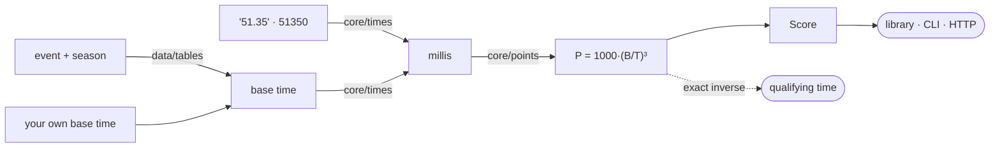

# Aqua Points Calculator

World Aquatics point scores for swimming performances. Usable as a Python library, as a CLI, and as a FastAPI service whose OpenAPI document exposes the same schema to services in other languages.

One formula, `P = 1000 · (B / T)³`, computed in integer arithmetic and truncated the way the published tables read — plus its exact inverse, for turning a point requirement into a qualifying time.

Ships the official World Aquatics base times for the last five seasons of each course, so you can score a swim by naming its event — or pass your own reference time and skip the tables entirely.

---

## Tech Stack

[![Python][Python.com]][Python-url]
[![Pydantic][Pydantic]][Pydantic-url]
[![FastAPI][FastAPI]][FastAPI-url]
[![Uvicorn][Uvicorn]][Uvicorn-url]
[![OpenAPI][OpenAPI]][OpenAPI-url]
[![uv][UV]][UV-url]
[![Hatch][Hatch]][Hatch-url]
[![Ruff][Ruff]][Ruff-url]
[![Prettier][Prettier]][Prettier-url]
[![mypy][Mypy]][Mypy-url]
[![pytest][Pytest]][Pytest-url]
[![pytest-cov][PytestCov]][PytestCov-url]
[![pip-audit][PipAudit]][PipAudit-url]
[![pre-commit][PreCommit]][PreCommit-url]
[![GNU Make][Make]][Make-url]
[![Docker][Docker]][Docker-url]
[![GitHub Actions][Actions]][Actions-url]

---

## Two Ways To A Base Time

Scoring needs a reference. Name an event and the base time comes from the tables
this package ships:

```python
from aqua_points_calculator import Course, Event, Gender, Stroke, score_for

event = Event(distance=100, stroke=Stroke.FREESTYLE, course=Course.LONG, gender=Gender.MALE)
score_for(event, "51.35").points  # 737, against the 2026 long-course table
score_for(event, "51.35", 2022).points  # 762, against the 2022 one
```

Or pass a base time of your own and no table is touched at all — for a national
record, an age-group standard, or a season older than the five shipped:

```python
from aqua_points_calculator import score

score("46.40", "51.35").points  # 737
```

The two are separate functions rather than one with an either/or argument, so
neither has a combination of inputs that makes no sense.

Five seasons ship per course, each the official World Aquatics table for that
season, with the document it came from recorded alongside it. Long and short
course run on different calendars and are numbered independently. See
[Base times](docs/base-times.md).

---

## Quick Start

### Prerequisites

| Tool                 | Version | Needed for                                     |
| -------------------- | ------- | ---------------------------------------------- |
| **uv**               | —       | dependencies, every `make` target              |
| **Python**           | 3.12    | fetched by uv from `.python-version`           |
| **Docker** + Compose | —       | `make up`, `make image`                        |
| **Node** (npx)       | ≥ 18    | Prettier in `make format`, fetched on demand   |
| **pre-commit**       | —       | the formatting hook before a commit (optional) |

### Install

As a dependency of another project:

```bash
pip install aqua-points-calculator            # library + CLI
pip install "aqua-points-calculator[api]"     # plus the FastAPI service
uv add aqua-points-calculator
```

Every GitHub Release is published to PyPI automatically, so the version there tracks the tags in this repository.

To work on the calculator itself:

```bash
make install     # uv sync --extra api
```

The `api` extra adds FastAPI and uvicorn. The calculator itself needs only Pydantic, so a library-only consumer can leave the extra out.

### Run

```bash
make dev         # CLI help with every subcommand
make serve       # FastAPI on :8000 with reload
make up          # the same in Docker
make ps          # container status and health
make logs        # follow the logs
make down        # stop and remove
```

### Use it

```python
from aqua_points_calculator import Course, Event, Gender, Stroke, points, score, score_for

# base time from the shipped tables
event = Event(distance=100, stroke=Stroke.FREESTYLE, course=Course.LONG, gender=Gender.MALE)
score_for(event, "51.35").points  # 737
score_for(event, "51.35", 2022).points  # 762, against the 2022 table

# base time of your own
points("46.40", "51.35")  # 737
result = score("46.40", "51.35")
print(result.points, result.time, result.base_time)
```

Times go in either as they are written or as raw milliseconds, and both forms come back out:

```python
score(46_400, 51_350).time  # '51.35'
score("1:02,34", "1:05.10").points  # comma or dot, minutes optional
```

```bash
# score a swim — base time supplied, or looked up from the tables
aqua-points-calculator points 51.35 --base-time 46.40
aqua-points-calculator points 51.35 --distance 100 --stroke freestyle --gender male
aqua-points-calculator points 51.35 --distance 100 --stroke freestyle --gender male --season 2022

# the inverse, the same two ways
aqua-points-calculator time 800 --distance 100 --stroke freestyle --gender male

# the tables themselves
aqua-points-calculator seasons
aqua-points-calculator base-times --course short --season 2025

aqua-points-calculator convert 1:02,34  # 62340
```

---

## HTTP Surface

| Method | Path                            | Purpose                                    |
| ------ | ------------------------------- | ------------------------------------------ |
| `POST` | `/points`                       | Score a swim                               |
| `POST` | `/time`                         | The slowest time still worth a given score |
| `GET`  | `/seasons`                      | Every base-time table the service ships    |
| `GET`  | `/base-times/{course}/{season}` | One whole table                            |
| `GET`  | `/health`                       | Liveness and the running version           |
| `GET`  | `/openapi.json`                 | The schema, for generated clients          |

`/points` and `/time` take the same either/or as the library — a `base_time`, or an `event` to look one up for:

```bash
curl -X POST http://localhost:8000/points \
  -H 'content-type: application/json' \
  -d '{"base_time": "46.40", "time": "51.35"}'

curl -X POST http://localhost:8000/points \
  -H 'content-type: application/json' \
  -d '{"event": {"distance": 100, "stroke": "freestyle", "course": "long", "gender": "male"}, "time": "51.35"}'
```

Unlike a file parser, there is no partial success here: a time either reads or it does not, so an unreadable one comes back as **422** rather than as a diagnostic. The document schema in `/openapi.json` is the same Pydantic model the library returns. See the [HTTP API](docs/api.md).

---

## Configuration

| Variable    | Default | Effect    |
| ----------- | ------- | --------- |
| `LOG_LEVEL` | `INFO`  | Log level |

There is nothing else. The service holds no state and can be mounted into another app with `app.include_router(aqua_points_calculator.api.router)`.

---

## Design

Times are integer milliseconds everywhere inside the package, never floats. The formula cubes a ratio of two times, so a binary float would make the last digit of a score depend on how the input happened to round; milliseconds are also what result files and timing systems actually carry, so no precision is invented on the way in.



More in the [architecture notes](docs/architecture.md).

---

## Common Commands

```bash
make help                     # every target
make test                     # unit tests, offline, no coverage gate
make test-it                  # full run incl. integration and coverage
make lint                     # ruff check
make format                   # ruff (Python) + prettier (md/yaml/json)
make format-check             # the same, read-only
make typecheck                # mypy
make audit                    # pip-audit
make image                    # build the runtime image
make clean                    # remove caches and the venv
```

---

## Further Reading

- [Getting Started](docs/getting-started.md) — install, score a swim, run the service
- [Base times](docs/base-times.md) — the shipped tables, the two calendars, where the numbers come from
- [Architecture](docs/architecture.md) — the pipeline and why times are integers
- [Scoring](docs/scoring.md) — the formula, the truncation, the inverse
- [Data schema](docs/data-schema.md) — how a score is laid out
- [HTTP API](docs/api.md) — endpoints, payloads, client generation
- [CLI](docs/cli.md) — subcommands, flags, exit codes
- [Extending](docs/extending.md) — wiring in a base-time table

## License

[MIT](LICENSE) — use it, change it, ship it, commercially or not.

<!-- MARKDOWN LINKS -->

[Python.com]: https://img.shields.io/badge/Python%203.12-3776AB?style=for-the-badge&logo=python&logoColor=white
[Python-url]: https://www.python.org
[Pydantic]: https://img.shields.io/badge/Pydantic-E92063?style=for-the-badge&logo=pydantic&logoColor=white
[Pydantic-url]: https://docs.pydantic.dev
[FastAPI]: https://img.shields.io/badge/FastAPI-009688?style=for-the-badge&logo=fastapi&logoColor=white
[FastAPI-url]: https://fastapi.tiangolo.com
[Uvicorn]: https://img.shields.io/badge/Uvicorn-499848?style=for-the-badge&logoColor=white
[Uvicorn-url]: https://www.uvicorn.org
[OpenAPI]: https://img.shields.io/badge/OpenAPI-6BA539?style=for-the-badge&logo=openapiinitiative&logoColor=white
[OpenAPI-url]: https://www.openapis.org
[UV]: https://img.shields.io/badge/uv-DE5FE9?style=for-the-badge&logo=astral&logoColor=white
[UV-url]: https://docs.astral.sh/uv/
[Hatch]: https://img.shields.io/badge/Hatchling-4051B5?style=for-the-badge&logo=python&logoColor=white
[Hatch-url]: https://hatch.pypa.io
[Ruff]: https://img.shields.io/badge/Ruff-D7FF64?style=for-the-badge&logo=ruff&logoColor=black
[Ruff-url]: https://docs.astral.sh/ruff/
[Prettier]: https://img.shields.io/badge/Prettier-F7B93E?style=for-the-badge&logo=prettier&logoColor=black
[Prettier-url]: https://prettier.io/
[Mypy]: https://img.shields.io/badge/mypy-1F5082?style=for-the-badge&logo=python&logoColor=white
[Mypy-url]: https://mypy-lang.org
[Pytest]: https://img.shields.io/badge/pytest-0A9EDC?style=for-the-badge&logo=pytest&logoColor=white
[Pytest-url]: https://docs.pytest.org
[PytestCov]: https://img.shields.io/badge/pytest--cov-0A9EDC?style=for-the-badge&logoColor=white
[PytestCov-url]: https://pytest-cov.readthedocs.io
[PipAudit]: https://img.shields.io/badge/pip--audit-2C5BB4?style=for-the-badge&logo=python&logoColor=white
[PipAudit-url]: https://pypi.org/project/pip-audit/
[PreCommit]: https://img.shields.io/badge/pre--commit-FAB040?style=for-the-badge&logo=precommit&logoColor=black
[PreCommit-url]: https://pre-commit.com
[Make]: https://img.shields.io/badge/GNU%20Make-A42E2B?style=for-the-badge&logo=gnu&logoColor=white
[Make-url]: https://www.gnu.org/software/make/
[Docker]: https://img.shields.io/badge/Docker-2496ED?style=for-the-badge&logo=docker&logoColor=white
[Docker-url]: https://www.docker.com
[Actions]: https://img.shields.io/badge/GitHub%20Actions-2088FF?style=for-the-badge&logo=githubactions&logoColor=white
[Actions-url]: https://github.com/features/actions
