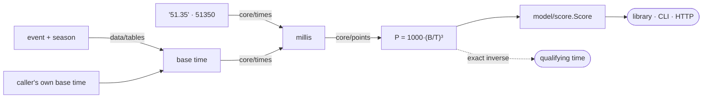

# Architecture

## The pipeline



Five layers, each importing only from the ones below it:

| Package          | Holds                            | Imports                 |
| ---------------- | -------------------------------- | ----------------------- |
| `core/`          | The formula and the time grammar | standard library only   |
| `model/`         | The pydantic schema              | `core`                  |
| `data/`          | The shipped base-time tables     | `core`, `model`, `yaml` |
| `api/`, `cli.py` | The two outer surfaces           | everything below        |
| `__init__.py`    | The public names                 | everything              |

`core/` importing nothing but the standard library is what lets the same code
back all three surfaces without any of them leaking into the others. It is also
why `core/` needs no fixtures, no client and no framework to test — and why the
formula itself never learns that a table exists.

There is one deliberate exception to the direction of imports.
`model/score.Score.for_event` needs `data/`, which sits above it, so that import
is made inside the method rather than at module scope. The alternative — putting
the lookup constructor in `data/` instead — would split the two ways of building
a `Score` across two modules, which is worse for the reader than one localised
import with a comment saying why.

## Why times are integers

Times are `int` milliseconds everywhere inside the package, never `float`
seconds.

The formula cubes a ratio of two times. With floats, the third significant digit
of a score would depend on how the input string happened to round on its way
through binary — two callers passing the same swim, one as `51.35` and one as
`51.350`, could disagree. Milliseconds are also the resolution result files and
timing systems actually carry, so nothing is invented on the way in and nothing
is lost.

`core/points.points` therefore cubes both times as integers and divides once:

```python
return BASE_POINTS * base_millis**3 // swum_millis**3
```

The truncation happens exactly once, at the end, rather than accumulating
through three float multiplications. Python's arbitrary-precision integers make
the intermediate cube free of concern.

## Why the inverse walks the last step

`time_for_points` needs the integer cube root of `1000 · B³ / P`. `round(x **
(1/3))` is off by one often enough at these magnitudes — the values are around
`10¹⁴` — to shift the returned time by a millisecond, which would break the
round-trip guarantee. So the float root seeds a candidate and two `while` loops
correct it:

```python
candidate = max(int(round(target ** (1 / 3))), 1)
while candidate**3 > target:
    candidate -= 1
while (candidate + 1) ** 3 <= target:
    candidate += 1
```

Each loop runs at most a couple of iterations from a seed that close. The
property this buys — `points(base, time_for_points(base, n)) == n` — is asserted
across the score range in `tests/unit/test_points.py`.

## Why the tables ship, and why they are still optional

Naming an event is what a caller usually wants, and requiring everyone to carry
their own copy of a published table made the common case tedious for no gain.
So the tables ship.

What does not change is that the base time remains an ordinary argument
underneath. `points()` takes a number; `score()` takes a number; only
`score_for()` reads a table. That keeps three properties worth having:

- A reference the tables do not hold — a national record, an age-group standard,
  a club benchmark, a season older than the five shipped — needs no escape hatch
  and no fake season. It is the same call it always was.
- The formula stays testable without any data files.
- Which season a historical result was scored against stays explicit. A base
  time is a per-season snapshot, so a score without its season is ambiguous,
  which is why `Score.season` records the table used and is `null` when the
  caller supplied the number.

The tables are data files rather than Python literals so they stay reviewable in
a diff and regenerable from the official publications. See
[Base times](./base-times.md).

## Why the tables are generated, not typed

There are 448 base times across the ten shipped tables. Typing those by hand
would be one transcription error away from a wrong answer that no test could
recognise as wrong, because a plausible-looking swim time is indistinguishable
from a correct one.

`tools/generate_base_times.py` parses them out of the official PDFs instead, and
three layers of checking sit on top:

1. Every base-times PDF prints each time twice — as `mm:ss.hh` and in seconds —
   and the parser compares the two. Across 356 values exactly one disagreed, and
   it was resolved against a third document.
2. `tests/unit/test_data.py` asserts structural invariants over every shipped
   file: times rise with distance within a stroke, the men's time is faster than
   the women's in every event, every value is a plausible swim, and each
   validity window matches its course's calendar.
3. Re-running the generator must reproduce the shipped files byte for byte, so a
   hand edit shows up as a diff.

The second layer is what catches the realistic failure — two columns of a PDF
getting crossed — which the first layer cannot see, because a swapped pair is
internally consistent.

## Why the API models are separate from the domain models

`model/score.Score` is what the calculator computes; `api/schemas.py` is what the
wire carries. Keeping them apart means a field can be added to a payload — a
request echo, a version stamp — without it appearing on the library's return
type. The one model that crosses the line is `Score` itself, embedded in
`ScoreResponse`: that _is_ the answer, and duplicating it would create two
schemas to keep in step.

The schemas carry one thing the library does not need: the `base_time`/`event`
either/or. The library expresses that as two functions, so no call can name both
or neither. A single HTTP endpoint has to accept both shapes, so the constraint
becomes a validator on `_Reference` — at the boundary, stated once, shared by
both endpoints.

The table listings (`SeasonsResponse`, `BaseTimesResponse`) are also what the
CLI's `--json` prints, built through the same classmethods: the payloads are one
construction, not two hand-built copies that can drift apart. `schemas.py`
imports only pydantic — no FastAPI — so the CLI reads it without the `api`
extra installed.

One more rule lives in exactly one place: the season default. Naming no season
means the latest shipped for the course, and `data/tables.resolve_table` /
`resolve_base_time` are the only code that applies that rule — the library, the
CLI and the API all resolve a lookup through them and stamp their results with
the season that actually answered.

## Why there is no state

The service has no database, no cache, no background work and nothing to warm
up, so there is no lifespan and no settings object. The base-time tables are read
from the installed package and memoised by `functools.cache`, which is the only
thing held between requests and is immutable. It scales by replication and
embeds into another app with one line:

```python
app.include_router(aqua_points_calculator.api.router)
```

Keeping it that way is a constraint worth defending, not an accident of it being
early.
